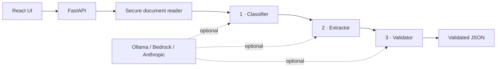
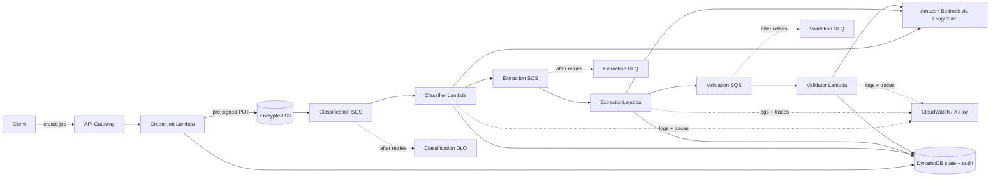

# Multi-Agent AI Document Pipeline

[](https://github.com/Gouthamraju11/MultiAgent-AI-DocPipeline/actions/workflows/ci.yml)
[](https://www.python.org/)
[](https://fastapi.tiangolo.com/)
[](https://react.dev/)
[](LICENSE)

A production-oriented document intelligence system that turns unstructured business documents into validated JSON. Three focused stages classify the document, extract type-specific fields, and gate the result through deterministic and semantic quality checks.

**[Open the free browser demo](https://gouthamraju11.github.io/MultiAgent-AI-DocPipeline/)** · **[Explore the API](#api)** · **[Review the AWS architecture](#event-driven-aws-architecture)**

> The hosted demo is deliberately **$0 and zero-credential**: processing happens in the browser and no content is uploaded. The FastAPI application adds PDF/DOCX support and optional LLM providers. The AWS stack is source code only until someone explicitly deploys it.

## What this project demonstrates

- A real classify → extract → validate workflow for invoices, contracts, receipts, forms, reports, letters, résumés, and unknown documents.
- Honest zero-key operation: deterministic mode extracts values from the supplied document instead of returning canned sample data.
- PDF, DOCX, TXT, Markdown, JSON, and CSV ingestion with explicit file-size, encoding, encryption, and scanned-PDF handling.
- Provider adapters for Ollama, Amazon Bedrock, and Anthropic, with safe automatic fallback to deterministic mode.
- An event-driven AWS implementation using API Gateway, S3, three SQS stages, Lambda, Bedrock through LangChain, DynamoDB, dead-letter queues, retry backoff, audit history, and CloudWatch/X-Ray observability.
- Idempotent stage commits under at-least-once SQS delivery, plus partial-batch failure reporting so successful records are not replayed.
- A responsive, accessible React interface with drag-and-drop upload, samples, validation feedback, JSON export, and a no-backend browser fallback.
- Automated backend, serverless-contract, security-audit, and production-build checks in GitHub Actions.

## Ways to run it

| Mode | Cost | Processing | Best for |
|---|---:|---|---|
| Browser demo | **$0** | On-device deterministic pipeline; TXT, MD, JSON, CSV and pasted text | Trying the UI instantly |
| Local FastAPI | **$0** | Local deterministic pipeline or local Ollama; all six file formats | Development and portfolio demos |
| AWS serverless | Usage-based | Bedrock agents across Lambda/SQS | Studying or deploying production architecture |

No AWS resources are created by cloning, testing, building, or publishing this repository.

## Local architecture



The API performs blocking document and model work in a thread pool, applies typed response contracts, restricts CORS, limits uploads, and returns request/timing metadata on every response.

## Event-driven AWS architecture



The [`template.yaml`](template.yaml) SAM/CloudFormation template creates isolated queues and DLQs, on-demand encrypted storage, least-privilege function policies, active tracing, and DLQ alarms. Each agent records its output atomically in DynamoDB before forwarding the next message. A replay sees the committed output and safely resumes forwarding instead of double-writing it.

> **Cost warning:** deploying this template creates AWS resources and Bedrock inference is usage-priced. Deployment is intentionally not part of CI or the free demo.

## Quick start — zero credentials

Requirements: Python 3.12+, Node.js 22+.

```bash
git clone https://github.com/Gouthamraju11/MultiAgent-AI-DocPipeline.git
cd MultiAgent-AI-DocPipeline

python3.12 -m venv .venv
source .venv/bin/activate                 # Windows: .venv\Scripts\activate
pip install -r backend/requirements-dev.txt

cp .env.example .env
uvicorn --app-dir backend main:app --reload --port 8000
```

In a second terminal:

```bash
cd frontend
npm ci
npm run dev
```

Open [http://localhost:5173](http://localhost:5173). The default `LLM_PROVIDER=mock` is deterministic, local, and free. It does **not** silently call a paid API.

### One-command Docker option

```bash
docker compose up --build
```

Open [http://localhost:8080](http://localhost:8080). Docker Compose explicitly selects free deterministic mode.

## API

Interactive OpenAPI documentation is available at [http://localhost:8000/docs](http://localhost:8000/docs).

| Method | Route | Purpose |
|---|---|---|
| `GET` | `/health` | Provider, mode, and upload-limit status |
| `POST` | `/process-text` | Process `{ "text": "..." }` |
| `POST` | `/process` | Process a multipart document upload |

```bash
curl http://localhost:8000/process-text \
  -H 'Content-Type: application/json' \
  -d '{"text":"INVOICE\nVendor: Northstar Software\nInvoice Number: NS-1042\nTotal Due: $900.00\nPayment Terms: Net 30"}'
```

Responses contain one stable contract:

```json
{
  "job_id": "8fc049ad02f1",
  "status": "complete",
  "llm_provider": "Deterministic demo mode",
  "pipeline": {
    "agent1_classification": { "doc_type": "invoice", "confidence": 0.795, "reasoning": "..." },
    "agent2_extraction": { "vendor": "Northstar Software", "invoice_number": "NS-1042", "total_amount": "$900.00" },
    "agent3_validation": { "valid": true, "issues": [], "warnings": [], "human_review_required": false }
  },
  "processing_time_ms": 2
}
```

## Provider configuration

Copy [`.env.example`](.env.example) and set `LLM_PROVIDER` explicitly when needed:

| Value | Behavior |
|---|---|
| `mock` | Deterministic, offline, and free |
| `ollama` | Local Ollama model; fails fast when unreachable |
| `bedrock` | Amazon Bedrock; requires AWS credentials and can incur charges |
| `anthropic` | Anthropic API; requires a key and can incur charges |
| `auto` | Opt-in discovery: Ollama → configured AWS → configured Anthropic → deterministic mode |

Document content is wrapped as untrusted data in every model prompt. Never commit `.env`, cloud credentials, or API keys.

## Quality and failure behavior

- Unsupported extensions return `415`; oversized files return `413`; unreadable content returns a safe `422`.
- Unknown or incomplete documents cannot silently pass validation—they are routed to human review.
- Large documents are chunked with overlap and structured results are deduplicated during aggregation.
- Model output is schema-normalized and parsed from fenced or explanatory responses without using `eval`.
- Scanned PDFs intentionally fail with an OCR-specific message instead of producing empty or invented data.
- The AWS path uses conditional DynamoDB writes, retry visibility backoff, DLQs, and `ReportBatchItemFailures`.

## Tests and checks

```bash
source .venv/bin/activate
pytest
ruff check backend serverless tests test_pipeline.py

cd frontend
npm audit --audit-level=high
npm run build
```

The suite covers API contracts, upload limits, all deterministic pipeline stages, document readers, required-field gates, Bedrock-response normalization, DynamoDB-safe numeric conversion, SQS partial failures, and the infrastructure contract.

## Repository map

```text
.
├── backend/
│   ├── app/                  # FastAPI, providers, readers, schemas, pipeline
│   └── Dockerfile
├── frontend/
│   ├── src/                  # React UI + free browser pipeline
│   └── nginx.conf
├── serverless/
│   ├── handlers/             # API + classify/extract/validate Lambdas
│   └── shared/               # Bedrock, state, documents, retries
├── tests/                    # Local and serverless tests
├── template.yaml             # AWS SAM / CloudFormation architecture
├── docker-compose.yml
└── .github/workflows/        # CI + free GitHub Pages demo
```

## Known boundary

This system extracts text from text-based PDFs. OCR for scanned documents is deliberately out of scope; a production extension would place Amazon Textract or another OCR adapter before classification. Human review remains mandatory for unknown types, missing required fields, and high-impact decisions.

## License

[MIT](LICENSE) © Goutham Raju
